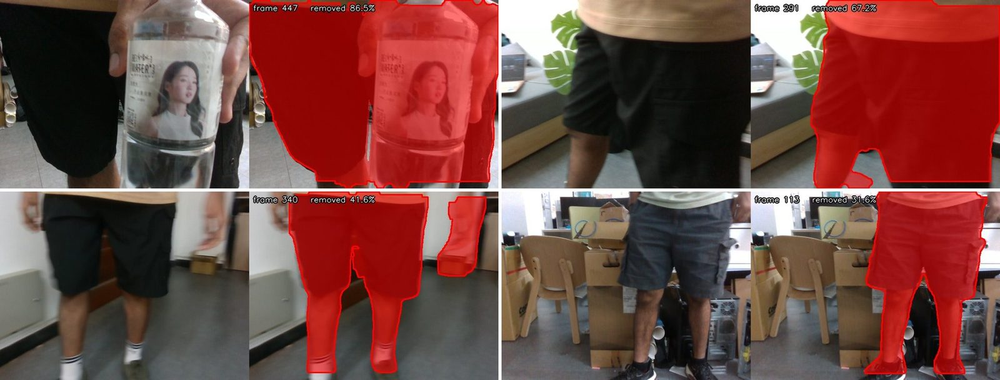
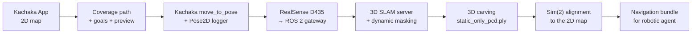
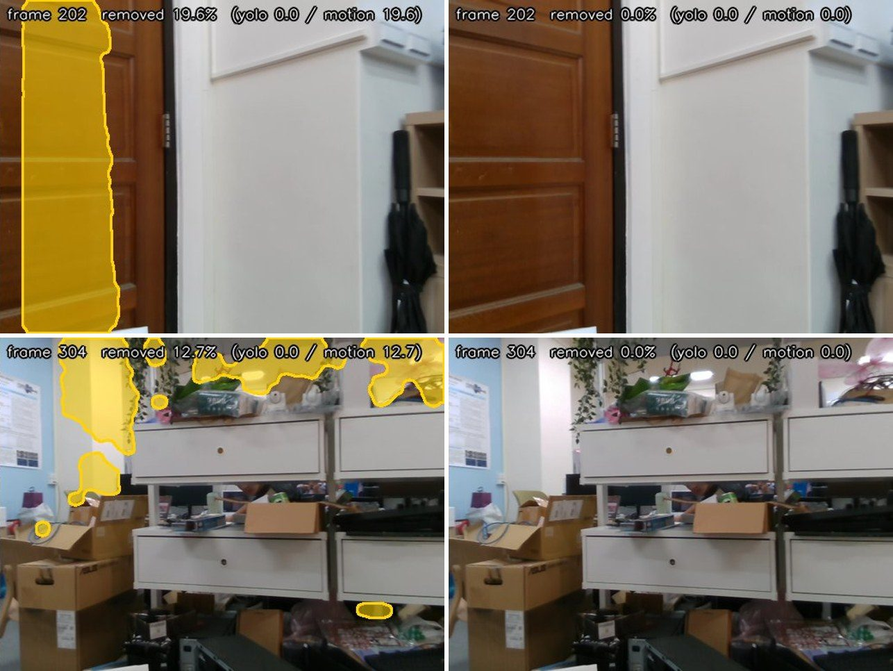
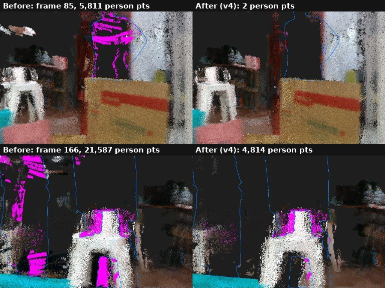

# Kachaka 3D SLAM 自動建圖 / Kachaka 3D SLAM Automatic Mapping

Kachaka 依覆蓋路徑自動行駛，RGB-D 相機同時錄影；3D SLAM 在建圖時即時移除人與移動中的物件，最後把 3D 地圖對齊到機器人的 2D 地圖，並輸出給 robotic agent 導航使用。

The Kachaka robot drives a planned coverage route while an RGB-D camera records. A 3D SLAM server builds the map and, at the same time, removes people and moving objects so they never become map points. The 3D map is then aligned to the robot's 2D map and packaged for the robotic agent's navigation.

**專案網頁 / Project page:** <https://gauravmeena1.github.io/kachaka_mapping/>



> **安全 / Safety:** 完整流程會移動 Kachaka，部分相機調整指令也會移動機械手臂。第一次使用請先跑離線測試與 `--plan-only`，正式執行時必須有人守在急停按鈕旁。The full workflow moves the robot, and some camera-tuning commands move the arm. Run offline tests and `--plan-only` first. A trained operator must stay within reach of the emergency stop during hardware runs.

## 功能 / Features

**規劃與行駛 / Planning and driving**

- 蛇行或螺旋覆蓋路徑 / Boustrophedon or spiral coverage paths
- 機器人半徑、牆面淨空與連通區域檢查 / Robot-radius, wall-clearance, and connectivity checks
- Waypoint 抽稀、最小點距與 yaw 變化限制 / Waypoint thinning, minimum-distance, and yaw-step limits
- 帶方向及順序的預覽圖 / Directional, ordered route previews
- 導航逾時安全取消 / Safe cancellation after navigation timeout
- Container、相機、手臂、磁碟與殘留程序 preflight / Preflight checks for containers, camera, arm, disk, and stale processes

**3D SLAM 與動態物件移除 / 3D SLAM and dynamic-object removal**

- 人一律移除；其他可移動物件只有移動或被拿著時才移除 / People are always removed; other movable objects only while they move or are carried
- YOLOv9e-seg 語意遮罩 + FlowSeek 光流運動殘差 + geo gate / YOLOv9e-seg semantic masks + FlowSeek motion residual + geo gate
- 人物遮罩擴張、box fill、3 幀 bridge、深度邊緣環 / Person-mask dilation, box fill, 3-frame bridge, depth-edge ring
- 多視角 3D carving，移除殘留在地圖中的人物點 / Multi-view 3D carving of person points left in the map
- 即時觀看：3D 地圖中被移除的點顯示為紅色 / Live view: removed points shown in red in the 3D map

**對齊與輸出 / Alignment and export**

- Pose2D logger 與 Sim(2) 2D/3D alignment / Pose2D logger and Sim(2) 2D/3D alignment
- 語意物件與 robotic agent 導航 bundle / Semantic instances and a navigation bundle for the robotic agent

## 系統流程 / How it works



`run_bridge_oneshot.sh` 以七個階段跑完整個流程，機器人移動前會停下來兩次請操作者確認。`run_bridge_oneshot.sh` runs the whole session in seven stages and stops twice for the operator before the robot moves:
1 preflight + map check → 2 export 2D map → 3 plan + preview → 4 pose logger → 5 SLAM + masking → 6 drive goals → 7 alignment.

## 結果 / Results

| 測試 / Test | 結果 / Result |
|---|---|
| 2D/3D alignment RMSE（map803 run5，修正 lever arm）/ with lever arm corrected | **0.077 m** (pass ≤ 0.30 m) |
| 無人畫面中被誤刪 >1 % 的幀數（geo gate 前→後）/ Person-free frames with >1 % removed, before → after geo gate | **59 → 1** of 296 |
| 地圖中殘留的人物點（v1 → v4）/ Person points left in the 3D map | **36,244 → 3,546** |
| 可取得導航目標的語意物件 / Semantic objects with a navigation goal | **57 / 68** |

| 誤刪修正 / False-positive fix (geo gate) | 3D carving 前後 / Before and after 3D carving |
|---|---|
|  |  |

完整數據與條件見 [`docs/DYNAMIC_MASKING.md`](docs/DYNAMIC_MASKING.md) 與專案網頁。Full numbers and conditions are in [`docs/DYNAMIC_MASKING.md`](docs/DYNAMIC_MASKING.md) and on the project page.

## 專案結構 / Repository layout

| Path | 中文用途 / Purpose |
|---|---|
| `run_bridge_oneshot.sh` | 七階段現場流程；移動前會確認 / Seven-stage field workflow with confirmation before motion |
| `make_bridge_traj.py` | 從 2D map 產生密集覆蓋路徑 / Generate a dense coverage trajectory from a 2D map |
| `drive_waypoints.py` | 抽稀及驗證導航目標；只有 `--go` 會移動 / Thin and validate goals; motion requires `--go` |
| `preview_traj.py` | 將路徑疊在地圖上 / Render a trajectory over the map |
| `preflight.sh` | 唯讀現場檢查 / Read-only site checks |
| `arm_cam_tune.sh` | 相機畫面與手臂收合姿態調整 / Camera view and arm stow-pose tuning |
| `dynamic_masking/` | 動態物件遮罩方法（YOLO、光流、融合規則）/ The masking method (YOLO, optical flow, fusion rules) |
| `slam_integration/` | 把遮罩接進 SLAM server（`fusion_solver.py`、3D carving、patches、`install.sh`）/ Hooks the masker into the SLAM server (`fusion_solver.py`, 3D carving, patches, `install.sh`) |
| `slam_tools/` | SLAM 啟動、即時觀看、重播、機器人控制 / SLAM launchers, live view, replay, robot control |
| `blur_vs_omega.py` | 選用的模糊與角速度分析 / Optional blur-versus-angular-speed analysis |
| `test_drive_waypoints.py` | 不需機器人的離線測試 / Offline tests without a robot |
| `docs/` | 操作指南、驗證報告、專案網頁 / Guides, validation reports, project page |
| `KNOWN_ISSUES.md` | 實機問題、原因與排除紀錄 / Field issues, causes, and workarounds |

生成物預設寫入 `artifacts/runs/` 與 `artifacts/previews/`，兩者都不會進 Git。模型權重（`yolov9e-seg.pt`、FlowSeek）也不在 Git 中。Generated files go to `artifacts/runs/` and `artifacts/previews/`; both are ignored by Git. Model weights (`yolov9e-seg.pt`, FlowSeek) are not in Git either.

## 快速開始 / Quick start (offline)

需求 / Requirements: Python 3.10+.

```bash
git clone https://github.com/Gauravmeena1/kachaka_mapping.git
cd kachaka_mapping

python3 -m venv .venv
source .venv/bin/activate
python -m pip install --upgrade pip
python -m pip install -r requirements.txt

python -m unittest discover -s . -p 'test_*.py' -v
```

在沒有 Kachaka 的電腦上也能規劃。準備相鄰的 occupancy-map PNG/YAML，並以 `--start x,y,yaw` 提供起點。Planning works without a robot when an adjacent occupancy-map PNG/YAML pair and an explicit start pose are provided.

```bash
python make_bridge_traj.py \
  --map-yaml /path/to/map.yaml \
  --start 0.0,0.0,0.0 \
  --pattern boustrophedon \
  --spacing 0.6 \
  --min-clearance 0.40 \
  --out artifacts/runs/traj_demo.csv

python drive_waypoints.py artifacts/runs/traj_demo.csv \
  --map-yaml /path/to/map.yaml \
  --save-goals artifacts/runs/goals_demo.csv

python preview_traj.py \
  --map-yaml /path/to/map.yaml \
  --traj artifacts/runs/goals_demo.csv
```

以上指令沒有 `--go`，不會移動硬體。These commands omit `--go` and therefore do not move hardware.

## 現場設定 / Site configuration

完整現場流程還需要 site-provided Kachaka API、Docker containers、pose logger 與 3D SLAM 工具鏈。The field workflow also requires a site-provided Kachaka API, Docker containers, pose logger, and 3D SLAM toolchain.

```bash
cp .env.example .env
# Edit .env: paths, endpoint, container names, and camera serial.
${EDITOR:-nano} .env

./preflight.sh --help
./preflight.sh --plan-only
```

`.env` 是本機設定並已被 `.gitignore` 排除。不要把內網 IP、帳號路徑、token 或相機序號提交到 Git。`.env` is local and ignored. Never commit private IP addresses, account-specific paths, tokens, or camera serial numbers.

`kachaka_api` 由 Kachaka SDK 提供，不在 PyPI requirements 裡；用 `KACHAKA_API_PATH` 指向其 Python package。`kachaka_api` comes from the Kachaka SDK and is not a PyPI dependency; point `KACHAKA_API_PATH` to its Python package.

選用相機／分析功能 / Optional camera and analysis tools:

```bash
python -m pip install -r requirements-optional.txt
```

`pyrealsense2` 依平台安裝，未必能直接由 PyPI 安裝。`pyrealsense2` is platform-specific and may require the vendor installation method.

## 執行 / Run

先只規劃與出圖 / Plan and preview only:

```bash
./run_bridge_oneshot.sh --name demo_01 --venue lab --plan-only
```

人工確認預覽圖、目前 Kachaka map ID、淨空與急停措施後，才執行完整流程。Run the full workflow only after reviewing the preview, active Kachaka map ID, clearance, and emergency-stop setup.

```bash
./run_bridge_oneshot.sh --name demo_01 --venue lab
```

安全機制 / Safety gates:

- `drive_waypoints.py` 沒有 `--go` 時只印計畫 / Without `--go`, it only prints the plan.
- Wrapper 在導航前要求人工確認；第一次不要用 `-y` / The wrapper confirms before navigation; do not use `-y` on a first run.
- `--reuse-map` 驗證目前 Kachaka map ID / `--reuse-map` verifies the active map ID.
- 生成與執行必須使用相同 `--min-clearance` / Planning and execution must use the same `--min-clearance`.
- Ctrl+C、API error 與 timeout 會走取消／收尾流程 / Ctrl+C, API errors, and timeouts trigger cancellation and cleanup.

所有參數 / Full CLI help:

```bash
./run_bridge_oneshot.sh --help
./preflight.sh --help
python make_bridge_traj.py --help
python drive_waypoints.py --help
python preview_traj.py --help
./arm_cam_tune.sh --help
```

## 地圖與 alignment / Maps and alignment

2D map、3D run、Pose2D log 與 alignment 必須屬於同一個 Kachaka map ID。Point-cloud quality alone is not sufficient: the 2D map, 3D run, Pose2D log, and alignment must belong to the same Kachaka map ID.

目前驗證紀錄 / Current validation reports:

- [`docs/ALIGNMENT_VALIDATION_20260921.md`](docs/ALIGNMENT_VALIDATION_20260921.md)
- [`docs/ONSITE_REMAP_RUN3_VALIDATION_20260922.md`](docs/ONSITE_REMAP_RUN3_VALIDATION_20260922.md)
- [`docs/ROBOTIC_AGENT_BUNDLE_VALIDATION_20260922.md`](docs/ROBOTIC_AGENT_BUNDLE_VALIDATION_20260922.md)

## 動態物件遮罩 / Dynamic-object masking

`dynamic_masking/`、`slam_integration/`、`slam_tools/` 讓 3D SLAM 在建圖時即時移除人與移動中的物件，並可即時觀看。安裝、離線測試、即時建圖與所有開關（`.env` 中的 `DYNAMIC_*`、`SEMANTIC=1`）見 [`docs/DYNAMIC_MASKING.md`](docs/DYNAMIC_MASKING.md)。
`dynamic_masking/`, `slam_integration/` and `slam_tools/` remove people and moving objects from the 3D map while it is built, with a live view. Setup, offline test, live run and every switch (`DYNAMIC_*` and `SEMANTIC=1` in `.env`): [`docs/DYNAMIC_MASKING.md`](docs/DYNAMIC_MASKING.md).

## 文件 / Documentation

- [專案網頁 / Project page](https://gauravmeena1.github.io/kachaka_mapping/)
- [`docs/DYNAMIC_MASKING.md`](docs/DYNAMIC_MASKING.md): 動態物件遮罩操作指南 / Dynamic-masking guide
- [`KNOWN_ISSUES.md`](KNOWN_ISSUES.md): 實機問題 / Field issues
- [`docs/FIELD_NOTES_2026.md`](docs/FIELD_NOTES_2026.md): 現場紀錄 / Field notes
- [`CONTRIBUTING.md`](CONTRIBUTING.md): 貢獻指南 / Contributing

## 提交前驗證 / Verification before commit

```bash
python -m unittest discover -s . -p 'test_*.py' -v
python -m compileall -q .
bash -n run_bridge_oneshot.sh preflight.sh preflight_legacy.sh arm_cam_tune.sh
```

GitHub Actions 會執行相同的離線檢查。GitHub Actions runs the same offline checks. Hardware-affecting changes additionally require a supervised low-speed test.

## 致謝 / Credits

建圖路線工具來自 [h44343880/kachaka_mapping](https://github.com/h44343880/kachaka_mapping)；動態物件遮罩與 SLAM 整合由 Gaurav 開發。The mapping route toolkit comes from [h44343880/kachaka_mapping](https://github.com/h44343880/kachaka_mapping); dynamic-object masking and the SLAM integration are by Gaurav.

## License

公開前請選擇並加入合適的 `LICENSE`。沒有 license 時，其他人雖能閱讀程式碼，但不代表取得複製、修改或散布授權。Choose and add a `LICENSE` before publishing. Without one, others may view the code but do not automatically receive permission to copy, modify, or redistribute it.
